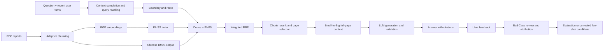

# MyAI RAG

MyAI RAG 是一个面向企业金融报告的检索增强问答项目。系统从 PDF 报告构建本地知识库，使用 Dense 向量检索与中文 BM25 混合召回，通过 RRF 融合、Chunk 级重排和页面选择确定证据，最后调用 SiliconFlow 上的模型生成带页码来源的答案。

## 核心能力

- 元素级、token 感知的自适应分块，当前上限为 448 tokens、重叠上限为 96 tokens。
- BGE Embedding + FAISS 本地向量检索。
- 中文字符 unigram/bigram BM25 精确词检索。
- 加权 RRF、公司过滤、页面去重与 Small-to-Big 上下文扩展。
- BGE Reranker 云端精排，并提供本地 BM25 降级路径。
- 多轮 RAG Query 补全：从最近的用户问题中继承公司、年份和财务意图，把追问改写为可独立检索的问题；无法确认实体时主动澄清。
- 知识边界拒答、确定性财务数据路由、数字校验和页码引用。
- Case-by-case 质量闭环：为每次回答保存检索链路，差评进入待审核 Bad Case 队列，人工归因后才能进入评测集或 few-shot 候选集。
- 120 题评测集，覆盖检索、排序、引用、拒答、路由和延迟指标。
- 线上与离线共用检索实现：Dense Top10、BM25 Top20、融合 Top30、RRF k=5、Dense:BM25=2:1。
- 分阶段耗时、p50/p95、真实返回的 token 用量，以及可追溯的人工答案评审；未测指标保留为空。

## 系统结构



Embedding 与 FAISS 在本地运行；Reranker 和生成模型通过 SiliconFlow API 调用。没有 API Key 时，索引构建和离线检索评测仍可运行，但云端精排与答案生成不可用。

## 目录

```text
.
├── src/myai_rag/          # 应用源码
│   ├── api.py             # FastAPI 服务与完整问答链路
│   ├── chunking.py        # 自适应分块
│   ├── indexing.py        # PDF 解析与索引构建
│   ├── retrieval.py       # 线上/离线共用候选召回与融合
│   ├── retrieval_config.py # 唯一检索配置默认值
│   ├── telemetry.py      # 请求级耗时、模型调用与 token 用量
│   ├── finance.py         # 确定性财务数据路由
│   ├── bad_cases.py       # Bad Case 队列、归因、审核与导出
│   ├── bad_case_cli.py    # 逐例审核命令行工具
│   ├── feedback.py        # 仅从人工审核样本生成 few-shot
│   ├── ui.py              # Streamlit 界面
│   ├── config.py          # 统一路径配置
│   └── cli.py             # 命令行入口
├── data/                  # 示例报告与结构化数据
├── evaluation/            # 数据集、脚本和代表性结果
├── tests/                 # 单元测试
├── docs/                  # 架构与评测说明
├── artifacts/             # 本地生成索引，不提交 Git
└── runtime/               # 反馈与缓存，不提交 Git
```

## 快速开始

建议使用 Python 3.10 或 3.11。

```bash
git clone https://github.com/iamnotchloe/myai.git
cd myai

python -m venv .venv
source .venv/bin/activate
python -m pip install --upgrade pip
pip install -e .

cp .env.example .env
```

在 `.env` 中填写 `SILICONFLOW_API_KEY`。API Key 只放本地 `.env`，不要提交到 Git。

### 构建知识库

```bash
myai-build-index
```

索引会生成在 `artifacts/faiss_index/`。该目录是可再生运行产物，因此不进入版本控制。

### 启动后端与前端

```bash
myai-api
```

另开一个终端：

```bash
myai-ui
```

健康检查：<http://127.0.0.1:8001/>

API 文档：<http://127.0.0.1:8001/docs>

### 调用问答接口

```bash
curl -X POST http://127.0.0.1:8001/rag_query \
  -H 'Content-Type: application/json' \
  -d '{"question":"那净利润呢？","history":[{"role":"user","content":"滨江消费品2021年营业收入是多少？"}]}'
```

上述追问会先被补全为“滨江消费品有限公司2021年净利润是多少？”，再进行路由（这个例子命中结构化财务数据）。响应中的 `resolved_question` 会返回该独立 Query；`debug=true` 时还会返回是否改写、置信度和原因。

调试检索链但不调用生成模型：

```bash
curl -X POST http://127.0.0.1:8001/rag_query \
  -H 'Content-Type: application/json' \
  -d '{"question":"滨江消费品2021年营业收入是多少？","debug":true,"retrieval_only":true}'
```

每个问答响应都会包含 `trace_id`。用户点“回答无用”时，前端把它连同反馈提交到 Bad Case 队列；系统不会把答案缓存成 FAQ，也不会自动把未经审核的反馈写进评测集或提示词。

### 逐例审核 Bad Case

```bash
# 查看待审核案例
myai-bad-cases list

# 判断错误发生在哪个环节，并补充正确答案或正确证据页
myai-bad-cases review BAD_CASE_ID \
  --stage reranker \
  --disposition evaluation_candidate \
  --notes "标准页已被粗召回，但没有进入重排结果" \
  --expected-pages-json '[{"source_file":"report.pdf","page_number":3}]'

# 只导出已审核、未忽略的案例
myai-bad-cases export
```

可归因环节包括 Query 改写、知识边界、PDF 解析、Chunk、Dense、BM25、融合、Reranker、生成、引用和拒答。该闭环依据语雀 RAG 文档 [1.3 评估与迭代](https://www.yuque.com/zhongxian-iiot9/mp8m88/zbta3mgurgvuq4sq#KivP1) 中的多维指标、错误案例归因、难例挖掘、用户反馈埋点与主动学习；混合召回和多阶段排查依据同页 [1.4 检索与排序优化](https://www.yuque.com/zhongxian-iiot9/mp8m88/zbta3mgurgvuq4sq#cJUFQ)。

## 测试与评测

```bash
pip install -e '.[dev]'
pytest

python evaluation/evaluate_query_rewrite.py

python evaluation/evaluate_retrieval.py \
  --dataset evaluation/datasets/dev_set_v2.jsonl \
  --tokenizer char-bigram \
  --show-failures

python evaluation/evaluate_api.py \
  --dataset evaluation/datasets/dev_set_v2.jsonl \
  --retrieval-only
```

Query 改写先用独立多轮样本检查重写准确率和澄清准确率；检索评测关注 Hit@K、Recall@K、Precision@K、MRR、MAP 和 NDCG；端到端评测同时检查答案、引用、拒答、路由和延迟。

`retrieval_only` 不调用生成，但仍可能调用付费云端重排；不是完整答案准确率评测。关键词检查只叫 `lexical_field_pass_rate`，不能当成语义正确率。Faithfulness 等通过 `evaluation/review_answers.py` 对保存的答案逐声明人工审核，未审核时为 `null`。详见评测说明。

## 配置与文档

所有配置项均记录在 [.env.example](.env.example)。常用路径也可以通过 `MYAI_DOCUMENTS_DIR`、`MYAI_STRUCTURED_FINANCE_PATH`、`MYAI_INDEX_DIR`、`MYAI_RUNTIME_DIR` 和 `MYAI_CACHE_DIR` 覆盖。

- [架构说明](docs/architecture.md)
- [评测说明](docs/evaluation.md)
- [已修复问题](docs/bugfixes.md)
- [评测数据与结果](evaluation/README.md)

## 数据与安全

- 仓库内 PDF 为项目示例数据；替换为真实企业资料前，请确认授权和隐私要求。
- `.env`、模型缓存、生成索引、反馈数据和运行缓存均被 `.gitignore` 排除。
- 当前仓库尚未声明开源许可证；除非仓库所有者另行授权，不应默认获得再分发权利。
